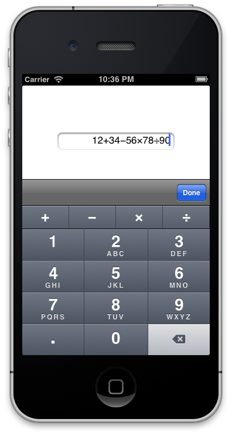

NRCalcPad
=========

This is a UITextField that adds basic calculator functionality.

A row of buttons is added above the iPhone numeric keypad for add, subtract, multiply and divide. If you use your own inputAccessoryView, it will appear above the calculator buttons. This example shows a UIToolbar inputAccessoryView with a Done button.

When the text field loses focus, simply call `[textField calculateResult]` to evaluate the typed formula, and replace the contents of the text field with the result. The result of the last calculation is available as a double in `textField.lastCalculatedResult`.

*Note that the calculation does not take into account normal operator precedence, it simply evaluates left to right.*

You can customise `textField.numberFormatter` to control the format of the result, eg. number of decimal places, as currency, etc.

Requirements
------------
A minimum of iOS 5.0 and ARC is required.

Licence
-------
NRCalcPad is (c) 2013 [Pinion Systems](http://pinionsystems.com/), and is released under the MIT licence. See LICENCE.

Attribution is appreciated but not required.
